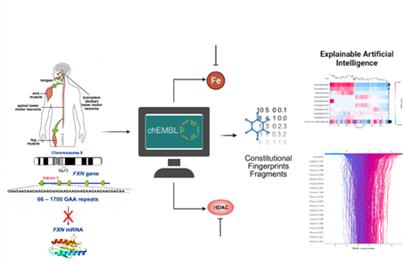

# DRUG MOLECULE TARGETING WITH EXPLAINABLE ARTIFICIAL INTELLIGENCE IN FRIEDREICH'S ATAXIA
This repository accompanies article DRUG MOLECULE TARGETING WITH EXPLAINABLE ARTIFICIAL INTELLIGENCE IN FRIEDREICH'S ATAXIA by Kevser Kübra Kırboğa, Ecir Uğur Küçüksille and Utku Köse.

# Summary

We present the analysis of target compounds for the genetic disease Friedreich's Ataxia and construct a regression model. We propose to analyze these models with the SHapley Contribution Annotations (SHAP) to determine the effect of molecular fingerprinting features and their significance contribution in the drug targeting process.

# Graphical Abstract

